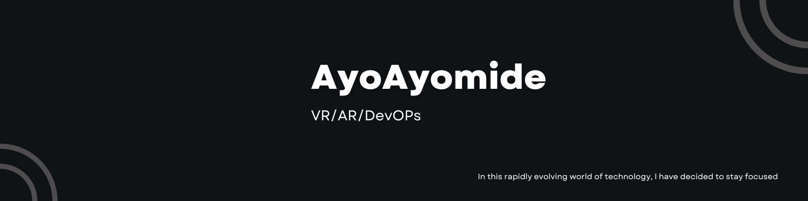

# Samuel Abel -- @ayoayomide

👋 Hi there! I'm Ayo, a software developer based in Lagos Nigeria. I'm always looking to learn and collaborate, so feel free to reach out and connect!

## Technology I have worked with includes.

- 

- 

-  
-    
- 

## My skills include

- Aframe/Three.js
- 3D design with Blender
- Game development with Unity
- UI/UX with Figma/XD

> In my free time, I do some TikTok videos check them out [@AyoAyomide](https://vm.tiktok.com/ZM86Ks7nV/) 

You can also reach me on.

- [Portfolio](https://ayoayomide.netlify.app/)
- [Pinterst](https://www.pinterest.com/ayoayomide124/)

<picture>
  <source media="(prefers-color-scheme: dark)" srcset="https://raw.githubusercontent.com/ayoayomide/ayoayomide/output/github-contribution-grid-snake-dark.svg">
  <source media="(prefers-color-scheme: light)" srcset="https://raw.githubusercontent.com/ayoayomide/ayoayomide/output/github-contribution-grid-snake.svg">
  
</picture>

## My Journey 

